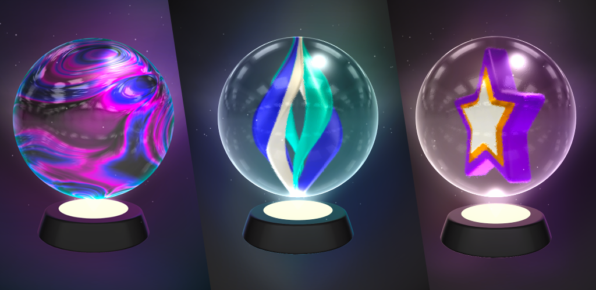

# 🔮 Marbles

There will be 20.000 Marble NFTs in the initial sale. All initial minting will be done using the Native Token (CRO). After 20.000 Marbles, new marbles will only be available through special in-game races and events.

We want marbles to be easily accessible & affordable, but we want them to be valuable at the same time. So we will increase the minting price of Marbles after every 2000 new Marbles minted.


NFT Contract


