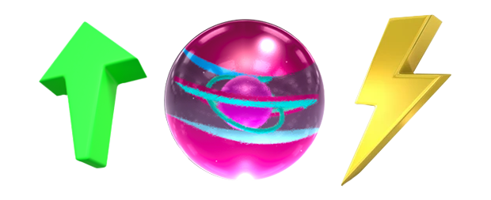

# ⬆ Skill Points

Each marble will have skill points which can be distributed over their stats for a customized gameplay experience. With the ability to change the stats of their Marbles, players will get to play more actively or more idle, according to their personal preference.

Marbles with different rarities will have different amounts of initial skill points at level 1. Each increase in Marble level will give 2 more skill points to be distributed on to the Marble stats.

Skill points will be used to determine the energy regeneration rate & energy capacity of a Marble.

| Upgrade                                            | Regen (Per Hour) | Capacity Increase |
| -------------------------------------------------- | :--------------: | :---------------: |
| <mark style="color:yellow;">Energy Regen</mark>    |    +1 Energy/h   |   +24 Max Energy  |
| <mark style="color:yellow;">Energy Capacity</mark> |    0 Energy/h    |   +48 Max Energy  |

Here's some possible configurations&#x20;

| Regen Level | Capacity Level | Regen Per Day | Max Capacity | Fill Duration |
| :---------: | :------------: | :-----------: | :----------: | :-----------: |
|      10     |        0       |      240      |      240     |     1 day     |
|      8      |        2       |      192      |      288     |    1.5 days   |
|      5      |        5       |      120      |      360     |     3 days    |
|      2      |        8       |       72      |      408     |    5.5 days   |
