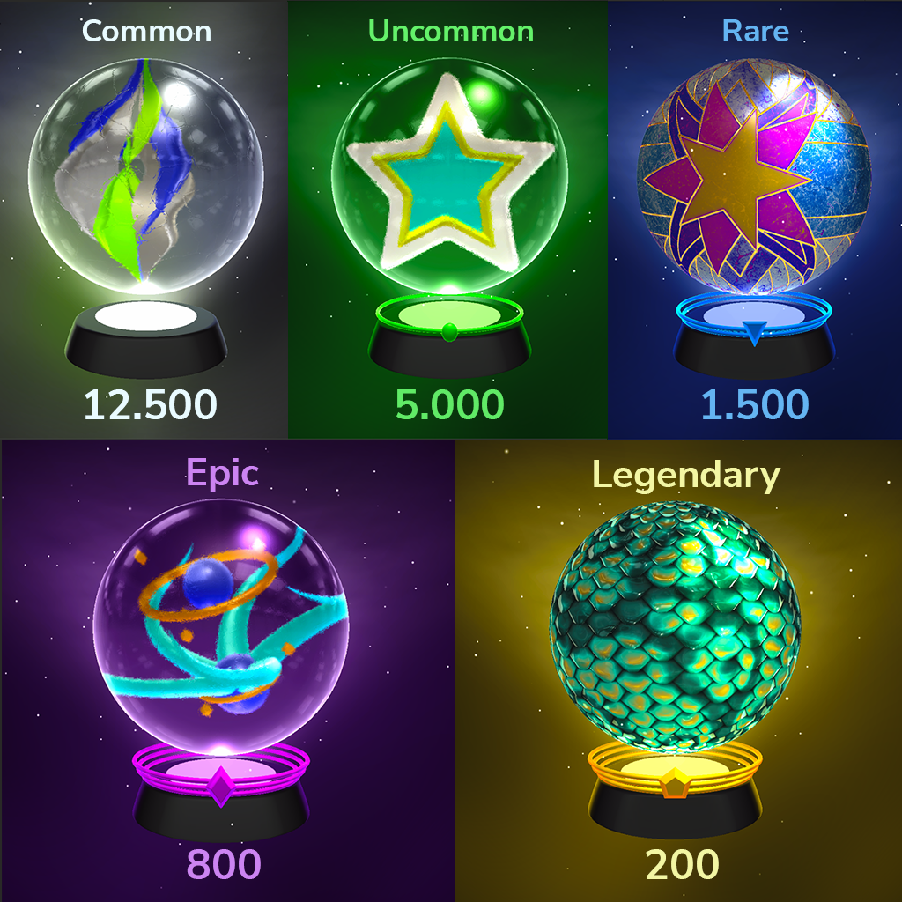

# 💎 Rarity System

There are five different types of Marbles. We guarantee 1 rare drop, in a pack of 10 Marbles mint.

| Rarity                                       |                Percent                | Initial Skill Points |
| -------------------------------------------- | :-----------------------------------: | :------------------: |
| Common                                       |                 62.5%                 |          10          |
| <mark style="color:green;">Uncommon</mark>   | <mark style="color:green;">25%</mark> |          20          |
| <mark style="color:blue;">Rare</mark>        | <mark style="color:blue;">7.5%</mark> |          30          |
| <mark style="color:purple;">Epic</mark>      | <mark style="color:purple;">4%</mark> |          50          |
| <mark style="color:yellow;">Legendary</mark> | <mark style="color:yellow;">1%</mark> |          80          |

Marble rarities determines the base & background of the marble. Amount of rings increase as rarity  goes up, also each rarity rank has their own symbol.
